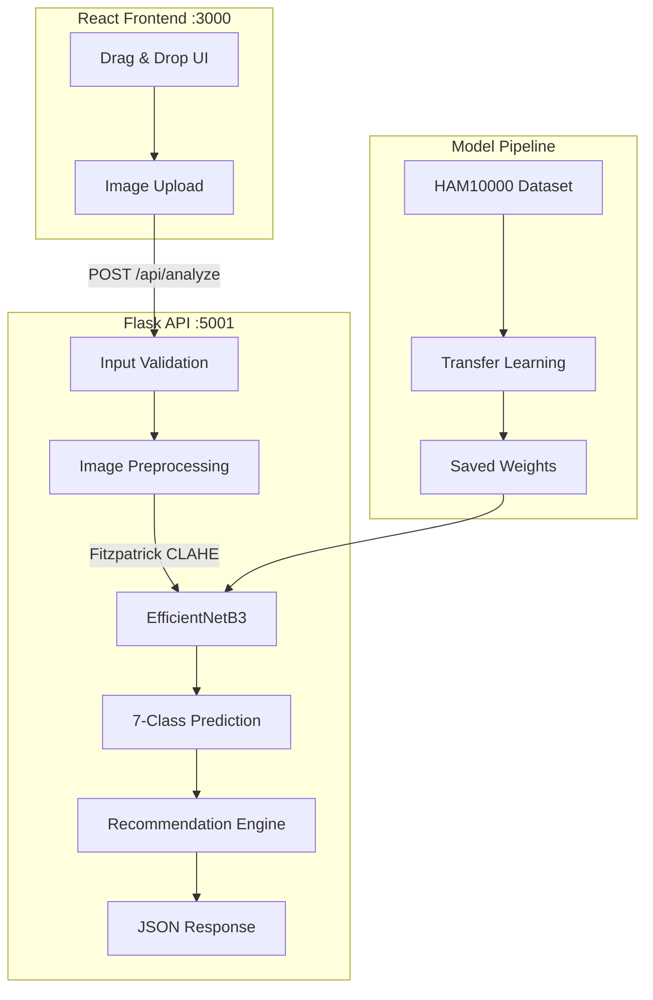

<div align="center">

# Skin Cancer Detector

[](https://python.org)
[](https://www.tensorflow.org)
[](https://flask.palletsprojects.com)
[](https://react.dev)
[](LICENSE)

**Full-stack medical AI application for skin lesion classification.** Uses EfficientNetB3 with transfer learning to classify dermoscopic images into 7 lesion types from the HAM10000 dataset.

> **Disclaimer:** This tool is for educational purposes only and is **not** a substitute for professional medical diagnosis. Always consult a dermatologist.

</div>

---

## Features

- **EfficientNetB3 transfer learning** -- pretrained on ImageNet, fine-tuned for 7-class skin lesion classification
- **Flask REST API** with rate limiting (30 req/min/IP), input validation, and structured JSON responses
- **React frontend** with drag-and-drop image upload, real-time results, and responsive design
- **Multi-language support** -- English, Russian, Spanish, Chinese
- **Skin tone adjustment** -- Fitzpatrick scale (I--VI) aware preprocessing with CLAHE
- **Demo mode** -- fully functional without a trained model (returns placeholder predictions)
- **Mobile scaffold** -- Capacitor-based iOS app shell

## Architecture



## Tech Stack

| Layer | Technology |
|-------|------------|
| ML Model | Python, TensorFlow/Keras, EfficientNetB3 |
| Backend | Flask, Flask-CORS, NumPy, OpenCV, Pillow |
| Frontend | React 18, CSS custom properties |
| Mobile | Capacitor (iOS) |

## Quick Start

### Prerequisites

- Python 3.8+ (3.11 recommended for TensorFlow compatibility)
- Node.js 16+

### One-Command Setup

```bash
git clone https://github.com/damn888daniel/skin-cancer-detector.git
cd skin-cancer-detector
./setup.sh          # Installs Python + Node dependencies
./start-all.sh      # Starts backend (:5001) and frontend (:3000)
```

### Manual Setup

```bash
# Backend
cd backend
python3 -m venv .venv && source .venv/bin/activate
pip install -r requirements.txt
python api.py                    # http://localhost:5001

# Frontend (separate terminal)
cd frontend/web
npm install && npm start         # http://localhost:3000
```

## API Reference

| Method | Path | Description |
|--------|------|-------------|
| `GET` | `/api/health` | Health check (model status, version, supported languages) |
| `GET` | `/api/info` | Lesion classes, skin tones, medical disclaimer |
| `POST` | `/api/analyze` | Analyze a skin lesion image |

### Analyze Request

```bash
curl -X POST http://localhost:5001/api/analyze \
  -F "image=@photo.jpg" \
  -F "skin_tone=III" \
  -F "language=en"
```

### Response

```json
{
  "success": true,
  "prediction": {
    "class_code": "mel",
    "class_name": "Melanoma",
    "confidence": 0.9234,
    "danger_level": "Malignant",
    "risk_score": 10
  },
  "recommendation": {
    "text": "Seek immediate dermatological evaluation",
    "urgency": "urgent"
  }
}
```

## Diagnostic Classes

| Code | Name | Danger Level | Risk |
|------|------|--------------|------|
| nv | Melanocytic Nevus | Benign | 1/10 |
| mel | Melanoma | Malignant | 10/10 |
| bkl | Benign Keratosis | Benign | 2/10 |
| bcc | Basal Cell Carcinoma | Malignant | 8/10 |
| akiec | Actinic Keratosis | Pre-cancerous | 7/10 |
| vasc | Vascular Lesion | Benign | 2/10 |
| df | Dermatofibroma | Benign | 1/10 |

## Training Your Own Model

```bash
# 1. Download HAM10000 from Kaggle
#    https://www.kaggle.com/datasets/kmader/skin-cancer-mnist-ham10000

# 2. Place images in backend/data/HAM10000/

# 3. Train
cd backend && python models/train_model.py

# Model saved to backend/models/saved_models/ (auto-loaded on next API start)
```

## Configuration

Key settings in `backend/config/settings.py`:

| Variable | Default | Description |
|----------|---------|-------------|
| `API_HOST` / `API_PORT` | `0.0.0.0:5001` | Server bind address (env overridable) |
| `MIN_CONFIDENCE_THRESHOLD` | 0.60 | Minimum confidence to return a prediction |
| `RATE_LIMIT_PER_MINUTE` | 30 | Max requests per IP per minute |
| `SUPPORTED_LANGUAGES` | en, ru, es, zh | Extend via `TRANSLATIONS` dict |

## Project Structure

```
skin-cancer-detector/
├── backend/
│   ├── api.py                        # Flask REST API with rate limiting
│   ├── config/settings.py            # Configuration, translations, lesion metadata
│   ├── models/
│   │   ├── model_architecture.py     # EfficientNetB3 classifier
│   │   └── train_model.py            # Training script
│   ├── utils/image_preprocessing.py  # Validation, CLAHE, Fitzpatrick preprocessing
│   └── requirements.txt
├── frontend/web/
│   ├── src/
│   │   ├── App.js                    # React application
│   │   ├── App.css                   # Responsive styles
│   │   └── index.js                  # Entry point
│   └── package.json
├── setup.sh                          # One-command setup
├── start-all.sh                      # Start both servers
├── start-backend.sh
└── start-frontend.sh
```

## License

This project is provided for educational purposes. See the medical disclaimer above.
